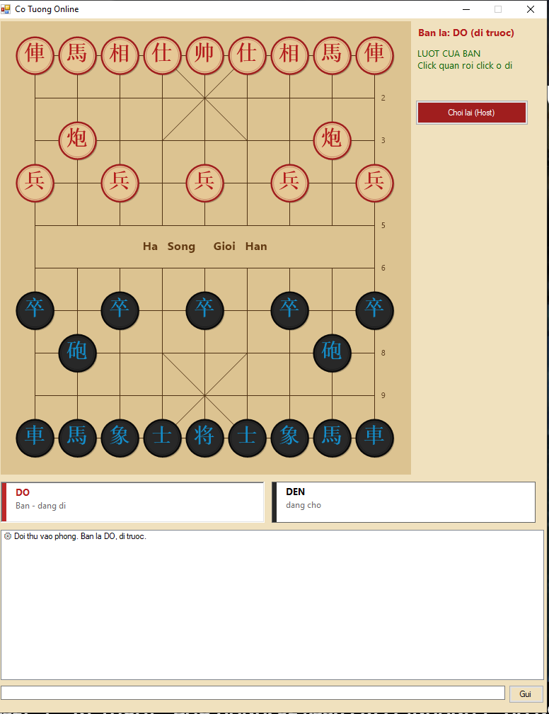

# Cờ Tướng Online

<p align="center">
  
</p>

Trò chơi Cờ Tướng (Xiangqi) 2 người chơi qua mạng LAN hoặc Online.
Kiến trúc mạng peer-to-peer đơn giản (NetworkPeer.vb), Host giữ quân Đỏ
đi trước, Client giữ quân Đen.

# Các tính năng chính
- PvP 2 người qua mạng LAN/Online
- Luật di chuyển đầy đủ cho tất cả 7 loại quân
- Phát hiện **chiếu**, **chiếu hết** (thắng) và **pat** (hòa)
- Highlight nước đi hợp lệ khi click chọn quân
- Danh sách quân đã ăn được hiển thị theo từng bên
- Chat trong game giữa 2 người chơi

# Các loại quân & luật di chuyển
| Quân | Ký hiệu | Luật di chuyển |
|------|---------|----------------|
| Tướng | 將/帥 | Di 1 ô ngang/dọc trong cung 3×3, không được để mặt đối mặt với Tướng địch |
| Sĩ | 士/仕 | Di chéo 1 ô, chỉ trong cung 3×3 |
| Voi | 象/相 | Di chéo 2 ô, không qua sông, bị chặn nếu ô giữa có quân |
| Mã | 馬 | Di hình chữ L (1 thẳng + 1 chéo), bị chặn nếu ô kề bị chiếm |
| Xe | 車 | Di thẳng không giới hạn ô, không qua quân khác |
| Pháo | 炮 | Di thẳng như Xe, nhưng khi ăn quân phải nhảy qua đúng 1 quân |
| Tốt | 卒/兵 | Trước sông: chỉ tiến thẳng. Qua sông: tiến thẳng hoặc đi ngang |

# Bố cục bàn cờ
- Bàn cờ **9 cột × 10 hàng**
- Quân **Đỏ** (Host): phía dưới màn hình, đi trước
- Quân **Đen** (Client): phía trên màn hình
- Sông chia đôi bàn cờ giữa hàng 4 và hàng 5

# Cách build
Yêu cầu: **.NET Framework 4.x** đã cài sẵn trên Windows.

```
buildexe_cotuong.bat
```

File `.exe` xuất ra cùng thư mục với tên `CoTuongOnline.exe`.

# Cách chơi

**Host (quân Đỏ, đi trước):**
1. Chọn **Tạo phòng** → nhập port (mặc định `9988`) → bấm Host
2. Chờ đối thủ kết nối

**Client (quân Đen):**
1. Chọn **Vào phòng** → nhập IP của Host và port → bấm Join
2. Chờ Host sẵn sàng

**Trong game:**
- Click vào quân của mình để chọn → các ô hợp lệ được highlight
- Click vào ô đích để di chuyển
- Bấm **Restart** để chơi lại (cả 2 bên cùng reset)

# Điều kiện thắng/hòa
| Tình huống | Kết quả |
|------------|---------|
| Đối thủ bị chiếu và không còn nước đi hợp lệ | **Thắng** |
| Đối thủ không bị chiếu nhưng không còn nước đi | **Hòa (Pat)** |

# Cấu trúc file
| File | Vai trò |
|------|---------|
| `XiangqiGame.vb` | Logic game: bàn cờ, luật di chuyển 7 loại quân, chiếu hết, pat |
| `Form1.vb` | Giao diện, vẽ bàn cờ, highlight nước đi, chat |
| `NetworkPeer.vb` | Kết nối mạng TCP giữa Host và Client |
| `Program.vb` | Entry point |
| `buildexe_cotuong.bat` | Script build bằng vbc.exe |
